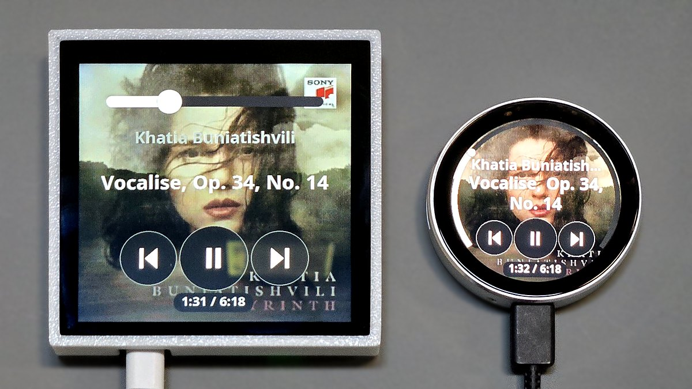

# Home Assistant Media Remote

A touch remote for one Home Assistant `media_player`, on an ESP32-S3 with a
small display. It shows what is playing -- the cover art filling the screen,
the title and artist over it, a volume control and the elapsed time -- and
gives you previous / play-pause / next, a volume swipe, a list of this room's
recent artists and recommendations, and an artist search. It talks to Home
Assistant directly, over its WebSocket and REST APIs, with nothing to install
on the server; Music Assistant adds the list and the search.



Three panels are supported:

| Board | Panel | Flash / PSRAM | Env |
|---|---|---|---|
| Waveshare ESP32-S3-Touch-LCD-1.28 | 1.28" round, 240×240 GC9A01 (SPI), CST816S touch | 16 MB / 2 MB | `waveshare-s3` (default) |
| DFRobot DFR1221 | 1.85" round, 360×360 ST77916 (quad SPI), CST816S touch | 16 MB / 8 MB | `round360-s3` |
| Adafruit Qualia ESP32-S3 (5800) | 4" square (5794), 720×720 TL040HDS20 (RGB-666 parallel), FT6336 touch | 16 MB / 8 MB | `qualia-720` |

A fourth target, `headless`, runs the whole remote with no display and
narrates to the serial console.

What you need:

- **Home Assistant**, reachable from the device. The remote finds it on the
  network and you sign in from your phone
  ([Linking to Home Assistant](#linking-to-home-assistant)), or give it a URL
  and a long-lived access token in the portal.
- **Music Assistant** (optional, but it is what the swipe-up list and the
  search are made of), with its Home Assistant integration.
- A **Music Assistant token** (optional) for the room's own recommendations.

```bash
pio run -e round360-s3 -t upload
```

---

## Contents

1. [The interface](#the-interface)
2. [Setting it up: the portal](#setting-it-up-the-portal)
3. [Building and installing](#building-and-installing)
4. [How the code is organised](#how-the-code-is-organised)
5. [Internals](#internals)
6. [Troubleshooting](#troubleshooting)

---

## The interface

### Now playing

The main screen. The current track's **cover art fills the screen** behind a
dim scrim, so white text stays legible over any image. Over it, top to
bottom:

- the **artist**, one line;
- the **title**, up to two lines, wrapped to the width available at its
  height -- on a round panel, the chord of the circle;
- the **transport row**: previous, play-pause and next;
- an **elapsed / total** chip.

Volume is an **arc round the bezel** on the round panels, and a **bar across
the top** on the square one. You do not have to grab it: a sideways swipe
anywhere in the **top half** moves it, by as far as the finger travels, from
wherever it already was. The arc on a round panel spans 70% of the
circumference, centred on twelve o'clock, leaving the gap at the bottom for
the transport row and the chip.

A quick **tap** in the same top half **toggles the volume device's power**
(`media_player.toggle`). The volume is drawn **grey while the volume device
is off**, as it is while muted. Switched on this way it gets what play gives
it -- the player's input and its volume at switch-on; see
[Powering the volume device](#powering-the-volume-device).

Details worth knowing:

- **Buttons follow what the player can do.** A button whose action the
  player's `supported_features` does not offer is drawn greyed. A player
  reporting no features at all is treated as supporting everything -- that is
  usually an integration that never set the attribute.
- **No volume control** is drawn for a volume device that reports no
  `volume_level` or lacks `VOLUME_SET`.
- **Play-pause answers at once.** The button lights for the length of the
  call and the glyph flips straight after; the next state from Home Assistant
  replaces it with whatever actually happened.
- **Between tracks the title area goes blank, not "Nothing playing".** A
  track change often passes through a second or so with no title. The screen
  only says "Nothing playing", "Idle", "Paused" and so on once there has been
  no title for three seconds (`kUntitledLabelDelayMs`).
- **An app that does not say what it is playing is titled with its name.**
  A Roku reports the show only on its TV tuner; in Apple TV, Netflix and the
  rest Home Assistant has the app's name and nothing more, so the title reads
  "Apple TV" while it plays or is paused, rather than "Nothing playing".
- **The title and the cover arrive together** when the cover is quick: a
  track change's repaint waits up to a second (`kCoverArtHoldMs`) for its art.
  A slow one shows the title over a plain backdrop, and the art drops in when
  it lands.
- **What is shown is what the room hears.** When the volume device is
  switched to an input other than the player's -- another player, or its own
  Spotify -- the screen and the buttons follow that instead; see
  [When the volume device is on another input](#when-the-volume-device-is-on-another-input).

### The swipe-up list

**Swipe up** on now playing for a short list in two sections, each row with
its artwork; **tap a row to play it**. The row stays on screen with
"Starting..." under it while Music Assistant builds the queue -- four seconds
and more for an artist.

| Section | With a Music Assistant token | Without one |
|---|---|---|
| **Recent here** | The last artists heard *in this room*, most recent first | Music Assistant's recent artists, headed "Recent artists" |
| **Recommended** | Artists similar to this room's recent ones, a fresh draw each load | A random draw of library albums |

"This room" is this remote's player: Music Assistant's own "recently played"
is shared by every player on the server, so two remotes in two rooms would
otherwise show the same list. How the room's list and the recommendations are
kept is in [Recent here](#recent-here-the-rooms-history) and
[Recommended](#recommended-artists-like-this-rooms).

The list follows your finger and glides on release. **Tap the title strip** or
**swipe right** to go back; it also goes back by itself after a minute
untouched (`kListIdleReturnMs`).

### Artist search

**Swipe left** on the list for a keyboard. Type part of a name -- the search
reaches every Music Assistant provider and forgives partial names, so
"radioh" finds Radiohead -- press **SEARCH**, and tap a result. The artist's
**radio** starts: an endless queue seeded from them, which is what a wall
remote is for (`kSearchPlaysRadio` plays the artist straight instead).

The keyboard is **alphabetical** by default, seven keys to a row, the last two
space and backspace. The portal's **Search keyboard** setting switches it to
**QWERTY** -- QWERTYUIOP, ASDFGHJKL, ZXCVBNM with backspace beside the M, and
a space bar on its own row -- with narrower keys, since ten have to fit across
the top.

**Swipe right** backs out one step at a time: results to the keyboard (with
the query kept, so a near miss can be edited), then the keyboard to the list.
A tap on the results that misses every result does the same.

### The status page

**Swipe down** on now playing for the remote's own details:

```
living-room
Living Room Speaker
Living Room Receiver
192.168.1.40
Up 2h 13m
HomeNet (ch 6)
Rx/Tx -61 / 11.0 dBm
        ⚙
```

Under the remote's name are the player and, when Volume & power is a separate
device, that device, both by their names in Home Assistant. When the player's
input on that device is chosen in the portal, the input takes the player's
line. Then come the address, the time since the remote started, the Wi-Fi
network and its channel, and on one line the signal the remote hears (**Rx**)
and the power it transmits with (**Tx**).

The page refreshes every second. The **gear** at its foot opens
[the settings](#settings-on-the-device), and a **swipe left** goes on to
[the Wi-Fi networks](#choosing-wi-fi-on-the-device); any other tap or swipe
goes back to now playing, and it goes back by itself after a minute untouched
(`kListIdleReturnMs`), as the list does.

### Choosing Wi-Fi on the device

The network can be chosen on the remote itself, without a phone: **tap** the
Setup or No Wi-Fi card, or **swipe left** on the status page to change
networks later.

The list is what a scan of every channel found, one row per network at its
strongest access point, strongest first: the name, its signal in bars, and a
lock where it wants a password. The network in use is highlighted. **Tap** an
open network to join it, or a locked one for the password page; the last row
scans again. **Swipe right** to back out.

The password page is a phone's keyboard: letters with **shift** (it stays on
until tapped again), **123** for digits and punctuation and **#+=** for the
rest of the symbols, **abc** back to the letters. What is typed is shown as
it is, its end in view, since a mistyped password is the usual reason a join
fails. **JOIN** lights at eight characters, WPA's shortest.

A join is kept only once it connects: until then the network saved before is
untouched, so a wrong password costs nothing. If it does not connect, the
list comes back saying so, and a remote that was connected goes back to its
old network. The portal's **Configure WiFi** does the same from a browser.

### Settings on the device

The **gear** on the status page opens the settings that need no typing, each
row a setting's name over its value:

| Row | Choices |
|---|---|
| Wi-Fi network | [The network list](#choosing-wi-fi-on-the-device); backing out of it comes back here |
| Media player | Home Assistant's media players, unavailable ones greyed |
| Volume & power | The media player itself, or another of them |
| Player's input | The volume device's inputs, or the one named after the player |
| Player volume at switch-on | Off, or 10% to 100% |
| Wi-Fi transmit power | The portal's steps, 8.5 to 19.5 dBm |
| Search keyboard | Alphabetical or QWERTY |
| Screen rotation | Upright, +90, 180 or -90; the remote restarts to apply it |
| Restart | Restart now, or cancel |

**Tap** a row for its choices, the one in use marked, and **tap** one to
choose it: it is stored at once, as a portal save would store it, and the page
comes back showing it. **Swipe right**, or tap the **back button** at the top
left, to back out without choosing, and again to go back to the status page.
The status page and the Wi-Fi pages have the button too. Player's input and
Player volume at switch-on are there only while Volume & power is a separate
device, as in the portal, and
a new Volume & power device keeps the player's input when it has one by the
same name. The last row says where the rest is set: the remote's name, the
Home Assistant link and Music Assistant are typed, so they stay in
[the portal](#setting-it-up-the-portal), which shows what was chosen here the
next time a page of it is opened.

### Status cards

When there is nothing to play yet, a card says why:

| Card | Meaning |
|---|---|
| **Setup** -- Join `MediaRemote-Setup`, or tap | No Wi-Fi configured; the setup access point is up. A tap chooses a network on the device |
| **Connecting** | Joining the saved network |
| **No Wi-Fi** -- Tap to choose | The saved network did not answer. A tap chooses another |
| **Link to HA** | Wi-Fi works and Home Assistant has not been found; set its URL and token in the portal |
| **Scan to link** -- a QR code | Home Assistant found; scan the code and sign in to link the remote |
| **Home Assistant** -- not reachable | Requests are failing; the last line is the reason |
| **Choose a player** -- a list | Linked, but no media player chosen; tap one, or choose it in the portal |
| **Reset** | Settings are being cleared (BOOT held) |

Cards are not interactive. Everything they complain about is fixed in the
portal, and the device notices the fix by itself within a couple of seconds.

### Blanking, and the amplifier

After **five minutes** with the player paused, idle, off or unavailable
(`kIdleTimeoutMs`, `kBlankWhenPaused`), the screen blanks -- backlight off,
panel asleep -- and the **volume device is switched off** with it. Any touch
wakes it, and so does playback starting from anywhere else.

The volume device is **switched on** only from the remote: pressing play,
choosing something from the list or the search, or a tap in the top half of
now playing, which also switches it off again. A zone amplifier is
**switched to the player's input** at the same time.
Playback started anywhere else -- a cast from a phone -- and a touch that only
wakes the screen leave it alone. Details in
[Powering the volume device](#powering-the-volume-device).

### Gestures

| Where | Gesture | Effect |
|---|---|---|
| Now playing | Tap a transport button | Previous / play-pause / next |
| Now playing | Swipe sideways, top half | Volume |
| Now playing | Tap the top half | Switch the volume device on or off |
| Now playing | Swipe up | Open the list |
| Now playing | Swipe down | Open the status page |
| Status page | Tap the gear | Open the settings |
| Status page | Swipe left | Choose a Wi-Fi network |
| Status page | Any other tap or swipe | Back to now playing |
| Settings | Drag up / down, then tap a row | Its choices |
| Settings choices | Tap one | Choose it, and back to the settings |
| Settings | Swipe right | Back one step |
| Status, settings, Wi-Fi | Tap the back button, top left | As a swipe right: back one step |
| Setup or No Wi-Fi card | Tap | Choose a Wi-Fi network |
| Wi-Fi networks | Tap a network | Join it, or type its password |
| Wi-Fi networks | Swipe right | Back one step |
| Player list | Drag up / down, then tap a player | Choose it; the last row fetches the list again |
| List | Drag up / down | Scroll; it glides on release |
| List | Tap a row | Play it |
| List | Tap the title strip, or swipe right | Back to now playing |
| List | Swipe left | Artist search |
| Search | Tap keys, then SEARCH | Search |
| Search results | Tap a result | Play that artist's radio |
| Search | Swipe right | Back one step |
| Blank screen | Any touch | Wake it; the volume device is left as it is |
| Hardware | Hold **BOOT** for 3 s (Qualia: the **DOWN** button) | Clear the settings and reboot into setup |

A tap on a list that was still moving, or on one the loop did not see the
finger for, is ignored rather than taken as a choice (`kListTapGuardMs`,
`kTouchWatchGapMs`): a swipe misread as a tap would start the wrong artist.

---

## Setting it up: the portal

Everything is configured in a web page served by the device. There are no
settings on the device itself: a `<select>` in a browser is a better list than
forty rows on a small circle, and it is reachable when the panel is not.

### Getting to it

**First time.** With no Wi-Fi saved, the device raises an access point,
**`MediaRemote-Setup`**. Join it; the setup page usually opens by itself, or
browse to **`http://192.168.4.1`**. Choose your network and fill in the fields
below. The device then joins your network. Or **tap the Setup card** and
choose the network on the device itself
([Choosing Wi-Fi on the device](#choosing-wi-fi-on-the-device)); the rest of
the settings are then in the portal on your network.

**Afterwards.** The same portal stays available on your network at
**`http://<device-name>.local`** -- `http://media-remote.local` until you name
it -- or at the device's IP address. **Configure WiFi** holds the settings
below, under the network name and password (leave those blank to keep the
current network; `/param` shows the settings alone). **Update** installs
firmware and **Info** shows the device's details. The status cards show the
name to look for.

A few rules hold for every field:

- **Secrets are never shown back.** The two token fields are always empty;
  their placeholder says whether one is stored. **Blank keeps the stored
  value.**
- **Saving applies at once**, except the device name and rotation, which
  restart the device a moment after the page answers.
- A dropdown that was not on the page you saved -- a page opened before the
  player list had loaded -- is left as it was, never blanked.
- **The player dropdowns follow Home Assistant.** Opening a settings page
  fetches the player list again if the remote's copy is more than five
  minutes old (`kHaPlayerListTtlMs`), so a player renamed or added since
  shows up; nothing is fetched while nobody opens the portal, and a failed
  fetch is tried again no sooner than 30 seconds later. A stored player the
  list no longer has -- renamed or removed -- is shown as itself, marked
  *(not listed now)*, rather than as whichever player happens to come first.

### Linking to Home Assistant

Once the remote is on Wi-Fi with nothing linked, it looks for Home Assistant
on the network: Home Assistant announces itself over mDNS
(`_home-assistant._tcp`), with its URL. When one answers, the card becomes a
**QR code**, with Home Assistant's name and the address the code stands for
beneath it. A URL already typed into the portal is used instead of looking.

1. **Scan the code** with a phone on the same network, or open the address
   under it in any browser there. It is the remote's own page, `/ha`, which
   sends the browser on to Home Assistant's sign-in page.
2. **Sign in** to Home Assistant as you always do.
3. Home Assistant sends the browser back to the remote, which takes it from
   there: it trades the sign-in for a **long-lived access token** named
   `Media Remote (<name>)`, revokes the short session the sign-in made,
   fills in the **Music Assistant config entry id** if that is blank, and
   stores the URL and the token.

The player is then the only thing left to choose: the remote lists Home
Assistant's media players, and a tap chooses one. The token
is listed in Home Assistant under your profile → **Security** →
**Long-lived access tokens**; deleting it there unlinks the remote.

The remote is the OAuth client, at its own address (`http://<its IP>/`,
which Home Assistant accepts for a client on the local network), and the
browser comes back to `/ha_auth` on the same address. That is why the phone
has to be on the remote's network, and why the address rather than the
`.local` name: Android does not resolve `.local` names. The code that comes
back is good for one use, for ten minutes, and only with a sign-in this
remote started.

Not found (no mDNS on the network, or Home Assistant on another subnet): the
card says to set the URL and token in the portal, and the remote looks again
every half minute.

### The fields

In the order the page shows them. After a save the confirmation page goes
back to the form by itself after 15 seconds (`config::kPortalSavedReturnMs`),
long enough for a setting that restarts the device to have taken effect. A
save is only acted on when the request carries the form, which includes a
hidden field for the purpose: a request to `/wifisave` or `/paramsave`
without it -- a reload of the confirmation page, a Back to it, or a reload
of an error page a restart left behind -- changes nothing and goes straight
back to the form.

**Wi-Fi transmit power** -- straight under the network and its password. 11
dBm unless changed, well below the 19.5 dBm the chip can do. Raise it for a
remote far from its access point: there the device can hear the access point
while the access point struggles to hear it back, which shows as lost pings
and stalled updates with a signal that looks fine. `/link` shows both ends
(see [Troubleshooting](#troubleshooting)). It takes effect as soon as it is
saved.

**Device name** *(restarts to apply)* -- what the device is called on the
network: its hostname, so a router lists it by name, mDNS answers for
**`<name>.local`**, and the portal's heading carries it. Default
`media-remote`. Give each remote its own -- `kitchen-remote`, `bedroom-remote`
-- rather than several answering to one name. What you type is cleaned into a
valid hostname: lowercase letters, digits and single hyphens, at most 31
characters. Blank keeps the current name.

**Home Assistant URL** -- e.g. `http://homeassistant.local:8123` or
`https://ha.example.net`. HTTPS works; the certificate is not checked, since
local installs are usually self-signed and the device has no clock to check
dates against.

**Long-lived access token** -- in Home Assistant, your profile → **Security**
→ **Long-lived access tokens** → **Create token**. Home Assistant shows it
once. Not needed when the remote was linked by its QR code: it made one of
its own.

**Music Assistant config entry id** -- needed for the list and the search: the
integration's services are addressed by config entry, not by entity. It looks
like `01J8Q4X2F7H3K9M5N6P0R1S2T3` (26 characters; older installs have 32 hex
characters). Home Assistant does not show it anywhere obvious and no REST
endpoint lists it, so it is typed rather than picked:

- **Tools → Actions**, choose **Music Assistant: Get library items**
  (`music_assistant.get_library`), pick your server in **Config Entry Id**,
  switch to **YAML mode**, and copy the `config_entry_id:` line; or
- **Settings → Devices & services → Music Assistant**, open its devices or
  entities, and read `?config_entry=…` from the address bar.

Without it, now playing, the buttons and the volume all work. The list shows
**Not set up** unless a Music Assistant token is set, the search fails, and
the room's history only gains artists picked on the remote, since turning a
heard name into an artist is a search.

Leaving the field blank keeps the stored id, as it does for the Home Assistant
URL and token. **Forget the stored config entry id** -- tick and save --
removes it.

**Music Assistant URL** -- where Music Assistant's own API is. Leave it blank
for the Home Assistant add-on: blank means Home Assistant's host on port 8095,
and the placeholder shows the address that works out to.

**Music Assistant token (for Recommended)** -- a long-lived token from Music
Assistant's own web UI (your profile there). Home Assistant's token does not
open Music Assistant's API, and the recommendations need that API. With a
token the list's two sections are the room's own; without one they are the
server's (see [the list](#the-swipe-up-list)).

**Forget the stored Music Assistant token** -- tick and save to remove it. The
list goes back to the server's sections. Ticked together with a new token, the
new one is kept.

**Screen rotation** *(restarts to apply)* -- upright, +90° (clockwise), 180°
or −90°, for a panel mounted any way up. The touch turns with the picture.

**Search keyboard** -- alphabetical or QWERTY. Takes effect the next time the
search opens.

**Media player** -- the player this remote controls. Listed once the device
can reach Home Assistant: on a first run, save the URL and token, let the
device connect, and reload the page. Until a player is chosen the screen
lists Home Assistant's media players by name, unavailable ones greyed, and a
tap on one chooses it, just as the dropdown does; the dropdown reads *Choose
a player…* meanwhile. A build of your own can name a default in
`config::kDefaultPlayerEntityId`.

**Volume & power** -- the entity that carries the volume and is switched on
and off, when that is not the player itself: a Music Assistant player
streaming into an amplifier or receiver, where the amplifier owns the real
knob and has to be on before anything is audible. Default *Same as the media
player*.

**Player's input on the volume device** -- which of the volume device's inputs
carries the player, when it switches inputs: a dropdown of that device's
`source_list` (`AirPlay`, `HDMI4`, `AUDIO1`…). *The input named after the
player* uses an input carrying the player's own name, which is how a Triad
zone amplifier lists its players; a receiver needs the input chosen here.
Changing **Volume & power** keeps it when the new device has an input by the
same name, and clears it otherwise.

**Player volume at switch-on** *(only with a separate volume device)* -- the
level, in percent, the *player's* own volume is set to each time the remote
switches the volume device on: play pressed, or something picked from the list
or the search, while it was off. Never when the player starts by itself, so a
cast from a phone keeps the volume it was cast at. Blank, the default, leaves
it alone (`config::kPlayerWakeVolume`).
70 is a sensible level to try. With the real knob on the amplifier, the
player's volume is the gain on the signal it hands over, and pinning it keeps
the amplifier's setting meaning the same thing from one session to the next;
see [Powering the volume device](#powering-the-volume-device).

### What a reset clears

Holding **BOOT** for three seconds -- the **DOWN** button on the Qualia, whose
GPIO 0 is a panel data line -- clears the device back to setup. The portal's
**Info → Erase WiFi config** clears less.

| Setting | BOOT held | Erase WiFi config |
|---|---|---|
| Wi-Fi network | cleared | cleared |
| Home Assistant URL, token, player, volume device, input, player volume at switch-on, Music Assistant entry id | cleared | kept |
| Music Assistant URL and token | cleared | kept |
| Wi-Fi transmit power | cleared | kept |
| Device name, screen rotation, search keyboard | kept | kept |
| The room's history | kept | kept |

Either way the device reboots into the setup access point.

---

## Building and installing

### Prerequisites

- **PlatformIO**, with the platform `platformio.ini` names: **pioarduino**
  (arduino-esp32 3.x on IDF 5.x). The stock `espressif32` platform predates
  these board definitions, and the two cannot share a machine happily: they
  want different `tool-esptoolpy` packages under one name, so each build
  strips the other's copy.
- **On Windows, build from PowerShell or cmd, not git-bash.** pioarduino's
  `idf_tools.py` aborts with "MSys/Mingw is not supported" whenever `MSYSTEM`
  is set.

Libraries are fetched by PlatformIO: LovyanGFX and WiFiManager.

### Building

```bash
pio run -e waveshare-s3      # 1.28" round (the default env)
pio run -e round360-s3       # 1.85" round 360x360
pio run -e qualia-720        # 4" square 720x720
pio run -e headless          # no panel
```

Each board's build embeds only the fonts it uses and compiles only its own
`src/hardware/<board>/` and `src/ui/<shape>/` (see
[the code](#how-the-code-is-organised)).

GitHub Actions builds all four on every push and pull request
(`.github/workflows/build.yml`). Each run's page under **Actions** has the
images to download: `firmware.bin` for a network update and
`firmware-merged.bin` for a blank board.

### First install, from the browser

**[pvanbaren.github.io/ha-media-remote](https://pvanbaren.github.io/ha-media-remote/)**
installs the latest release on a board plugged in over USB, with nothing to
build: click **Install** for the board and choose its port. It needs Chrome,
Edge or Opera on a computer (Web Serial; not Firefox, Safari or a phone).
The **Qualia** goes into download mode by hand first -- hold BOOT, tap RESET,
let go of BOOT -- since its USB port is the firmware's own and the browser
cannot restart it into the bootloader.

It writes the release's `firmware-<board>-merged.bin` from address 0, so like
any merged image **it wipes the settings**: it is for a blank board, or one
being set up again. Update a remote that is already set up from its portal.

The page is `site/`, published to GitHub Pages by
`.github/workflows/pages.yml` whenever a release is published: the page, a
manifest per board with the release's tag written in, and the release's
merged images beside them. The images are copied rather than linked, since a
release download carries no CORS headers and the browser would refuse it.
The flashing is [ESP Web Tools](https://esphome.github.io/esp-web-tools/).
GitHub Pages has to be set to build from GitHub Actions once, under
**Settings -> Pages**, and the workflow can be run by hand to publish the
page again for the latest release.

### First install, over USB

```bash
pio run -e round360-s3 -t upload
pio device monitor
```

This writes the bootloader, the partition table, the OTA data and the app,
each at its own offset -- and leaves the settings partition alone, so a
device keeps its settings across a USB flash.

- **Waveshare**: a CH343 USB-serial bridge; the port auto-detects.
- **DFR1221**: the S3's own USB port.
- **Qualia**: the firmware's USB port reboots into the bootloader on a
  different COM port partway through. If PlatformIO reports the old port gone,
  run the upload again, or name the bootloader's port with `--upload-port`.

Pin a port on one machine with an untracked `platformio-local.ini` beside
`platformio.ini` (`upload_port`, `monitor_port`); it is optional and globbed
in.

`pio run -t merge` writes `firmware-merged.bin`, one image from address 0 for
a web flasher. **It wipes the settings** -- it is padded over the settings
partition -- so use it for a blank board, not an update.

### Updating over the network

The flash has **two 4 MB app slots** (`partitions/media_remote.csv`), so a
running device takes new firmware without a cable: open **Update** in its
portal and upload `.pio/build/<env>/firmware.bin` -- the app image, not the
merged one. It is written into the slot that is not running, and the device
reboots into it once it has arrived whole. Settings are kept. From a shell:

```bash
curl -F "update=@.pio/build/round360-s3/firmware.bin" http://bedroom-remote.local/u
```

A device flashed before the table had a second slot answers "Partition Could
Not be Found" and carries on unharmed; one USB flash gives it the new table.

### Fonts

Text is anti-aliased VLW, one embedded face per pixel height the UI uses on
that board -- LovyanGFX scales VLW nearest-neighbour, so every size is
rendered natively rather than scaled. Regenerate from the bundled Noto Sans
Regular:

```bash
python scripts/build_ui_font.py assets/fonts/NotoSans-Regular.ttf \
    --out-dir data --heights 23,26,30,36
```

The generator solves a whole-pixel size for each height, and four land a
pixel high: 15, 23, 36 and 38 measure 16, 24, 37 and 39. That is inside the
pixel `display_font.cpp` allows before it rescales, so they are still drawn
natively.

Three lists must agree for a board: `--heights`, `board_build.embed_files` in
its env, and `kFonts[]` in its `src/hardware/<board>/font_table.cpp`.

| Board | Faces |
|---|---|
| Waveshare | 15, 17, 20, 24 |
| DFR1221 | 23, 26, 30, 36 |
| Qualia | 34, 38, 45, 54, and 23, 26, 30 for the lists |

The character set is 175 glyphs: ASCII, the Latin-1 letters and punctuation,
Œ/œ, ẞ, and the dashes and curly quotes track titles are full of -- Spanish,
Portuguese, German and French completely, and the other Latin-1 languages
with them. A missing glyph renders as a space. **Ÿ (U+0178) is excluded on
purpose**: it sits outside the range LovyanGFX skips when it measures line
height, and it is 4 px taller than any ASCII letter, so including it shrank
every label by a size. The generator refuses to add it back.

---

## How the code is organised

### Layers

```
src/
  main.cpp       setup() and loop(), handed straight to app/
  app/           what the remote decides and does          <- no display
  services/      Home Assistant, Music Assistant, settings  <- no display
  ui/
    common/      every screen that does not care what shape the panel is
    round/       theme.cpp, now_playing.cpp   <- the round panels
    square/      theme.cpp, now_playing.cpp   <- the Qualia
    headless/    draws nothing, narrates to serial
  hardware/
    waveshare/  round360/  qualia/  headless/   <- one directory per board
include/
  board/         one header per board: pins, sizes, scales, timings
  config.h       everything about the application that is a number
```

**The panel is a build-time choice.** `include/ui/ui.h` is the seam. Above it,
nothing includes a graphics library; each env in `platformio.ini` picks a
`board/<board>.h` with `-DBOARD_HEADER` and a `ui/<shape>/` and
`hardware/<board>/` with `build_src_filter`. A new panel is a header, a
directory and an env, not an `#if`.

**The input half is what earns the seam.** The display does its own hit
testing -- only it knows where it drew the buttons -- and hands back what the
gesture *meant*: `Intent::kPlayPause`, `kSetVolume` with a level,
`kPlayBrowseRow` with an index. The round panel reads a volume swipe as travel
along its arc and the square one as travel along its bar; `src/app/` gets the
same intent from both.

**Only two files know the panel's shape.** Of the UI, `theme.cpp` answers
"how wide is the screen at this height" (`chordHalfWidth()`: the chord on a
circle, the full width on a square) and `now_playing.cpp` holds the one
screen with a shape in it. The list, the search, the status cards, the
canvas, the artwork and the text layout are shared, and widen to fit by asking
`chordHalfWidth()`. The DFR1221 reuses `ui/round/` unchanged at 1.5×.

**Every dimension scales.** `include/ui/theme.h` is written against a 240 px
round panel and multiplied by the board's `kUiScale` (width / 240). Two more
per-board factors sit on top and nowhere else: `kTextScale` for panels whose
pixels are denser than the design's (the Qualia's 0.75), and `kListScale` for
the lists (the Qualia's ⅔, which shows about six rows instead of three).

**`headless` is a standing check,** not a toy: it builds and runs the whole
remote with `ui/headless/`. If it stops linking, something in `src/app/` or
`src/services/` has grown a pixel.

### Files

```
src/app/app.cpp            the state machine: what to show, commands, idle
                           timer, and the network task that owns the stream
src/services/
  wifi_setup.cpp           WiFiManager: setup AP, LAN portal, every field
  ha_client.cpp            templates, service calls, the library and search,
                           Home Assistant settings in NVS
  ha_stream.cpp            the WebSocket state stream, and calls over it
  websocket.cpp            an RFC 6455 client over a Yielding socket
  ha_internal.h            what ha_client and ha_stream share
  player_list.cpp          cached media_player list for the portal
  browse.cpp               the swipe-up list's sections
  search.cpp               the artist search query and results
  history.cpp              the room's recent artists
  recommend.cpp            the room's recommendations, on a task of its own
  ma_api.cpp               Music Assistant's own API, and its settings
  display_settings.cpp     rotation and keyboard layout
  device_name.cpp          hostname and mDNS
src/ui/round/, src/ui/square/
  theme.cpp                chordHalfWidth(): the panel's shape
  now_playing.cpp          the main screen: volume arc or bar, transport
src/ui/common/
  ui.cpp                   touch -> intents, drags, glides, what to show
  canvas.cpp               the composed frame, presenting, in-place scroll
  browse_list.cpp          the list, with section headings
  search.cpp               keyboard and results
  status_screens.cpp       the cards, and the status page
  settings_list.cpp        the settings page and each setting's choices
  artwork.cpp              the worker: list thumbnails and the cover fetch
  cover_art.cpp            cover and thumbnail fetch, cache, decode
  text.cpp                 ellipsising and word wrap
src/hardware/
  touch_gestures.cpp       press tracking, tap / swipe, the touch queue
  display_font.cpp         picks the embedded face for a height
  <board>/display.cpp      panel bring-up, backlight, sleep, rotation
  <board>/touch_raw.cpp    reads the touch controller
  <board>/font_table.cpp   the faces this board embeds
  <board>/boot_button.cpp  the reset button (the Qualia's is on its expander)
  qualia/rgb.cpp           the RGB panel's framebuffer, copy and scroll
  qualia/expander.cpp      the TCA9554: panel reset, backlight, buttons
scripts/
  build_ui_font.py         the VLW font generator
  board_header_stamp.py    rebuilds everything when the board header changes
  merge_firmware.py        pio run -t merge
partitions/media_remote.csv  the flash layout, shared by every board
.github/workflows/build.yml  CI: builds every board on each push
.github/workflows/pages.yml  the install page, on each published release
site/                        the install page and its board manifests
```

### Tasks

| Task | Does |
|---|---|
| Arduino loop | Touch, drawing, the idle timer, service calls a button makes |
| Network task (`haPollTask`) | Owns the state stream, or polls without it; history, list loads, picture lookups |
| Artwork worker (`thumbs`, core 0) | The now-playing cover first, then list thumbnails |
| Recommendations (`recommend`, stack in PSRAM) | Builds the recommendation pool from Music Assistant's API |
| Touch sampler (Qualia only) | Reads the touch controller into a queue of timestamped changes |

They share three kinds of thing, each with its own discipline:

- **One `PlayerState`** behind `g_state_mutex`. The network task writes it;
  the drawing code takes a copy. Nothing holds a pointer into it.
- **Self-serialising modules** -- browse, history, the cover, the artwork
  pool, the recommendations -- that hand back copies, never views, and create
  their locks in `init()` on the Arduino task before the other tasks exist.
  Never lazily: two tasks that each find a null handle and each make a mutex
  lock different ones.
- **Flags**, `std::atomic` rather than `volatile`: `volatile` promises nothing
  about ordering or about the other core seeing the write, and the S3 is
  dual-core. Every flag here is lock-free on it.

Service calls made from the loop (a button) are handed to the network task
through a one-deep slot and go over the stream; if that task cannot take them
within `kHaStreamPickupMs`, they go over REST instead rather than wait.

---

## Internals

### Talking to Home Assistant

**State comes from one Jinja template.** Rather than `GET /api/states` --
every attribute of every entity, and an AV receiver's `source_list` alone is
tens of kilobytes -- the firmware renders a template that emits exactly the
fields it needs, separated by the ASCII unit and record separators: state,
title, artist, picture, features, duration, position and *how stale* the
position is, name, then the volume device's volume, mute, features, state,
source and input, the artist and track for the history, and which entity is
being followed. A few hundred bytes. The position age is why the progress is
right the moment it appears: the firmware adds it back, having no clock of its
own.

**It is pushed, not polled**, whenever Home Assistant will give a stream. The
firmware opens the WebSocket API (`/api/websocket`, over TLS for an https URL),
authenticates with the same token, and subscribes to the template with
`render_template`. Home Assistant works out which entities it reads and sends
a fresh rendering whenever one changes: a volume change, a track starting, a
pause from a phone -- each in one round trip, and nothing asked while nothing
happens. The template reads `now()`, so it re-renders once a minute too, which
keeps the position honest and proves the link alive. A burst of changes (a
track change is title, then art, then duration) is settled for
`kHaStreamSettleMs` into one repaint.

**Steady state is one connection and one TLS session.** Service calls go over
the same socket -- transport, volume, power, `select_source`, `play_media` --
and so do Music Assistant's `get_library` and `search`, which ask for the
service's response back. mbedTLS takes its buffers from internal RAM only,
and a second TLS session beside the stream's, with a cover being fetched as
well, is one more than fits. Of the Home Assistant requests, only the
portal's player list uses REST while the stream is up.

**Without a stream it polls**: before the first connection, after a drop, or
against a server that refuses one. Every `kHaPollPlayingMs` (2 s) while
playing and `kHaPollIdleMs` (8 s) otherwise, retrying the stream on a backoff
from 5 s to a minute. A stream that had been working for a minute is reopened
at once; one closed sooner counts as a failure, so a server that accepts the
connection and refuses the subscription cannot cause a reconnect loop.
Changing the server, token, player or volume device resubscribes. The TLS
handshake is bounded by `kHaStreamHandshakeMs`. The WebSocket client is a few
hundred lines of RFC 6455 over the project's own sockets rather than a
library: the libraries create their own TLS client (which could not be made to
sleep instead of spin) or need an IDF rebuild.

**Sockets sleep, not spin.** `services::Yielding` wraps the Arduino clients so
every wait blocks for a tick. A task spinning on a slow server at the idle
task's priority starved the idle task on its core into the watchdog, and
priority inheritance through the connection mutex meant a low priority alone
could not prevent it.

**Requests are built by hand.** JSON bodies escape every control character as
`\u00XX` (`appendJsonString`); ArduinoJson writes the separators raw, which
Home Assistant rejects with HTTP 400. Responses -- Music Assistant's are JSON,
and no template can call a service -- are parsed by walking each object's own
members and stepping over every value whole, because an album nests an
`artists` array whose objects have their own `name` and `image`.

> **Never use `` in these templates.** Python counts `0x1C`–`0x1F` as
> whitespace, so a trimming tag silently eats the separator next to it and
> shifts every field after it by one.

Duplicate friendly names are the norm -- a Music Assistant player and the
device it wraps share one -- so the portal relabels a duplicate with its
`object_id`, and nothing shown carries the `media_player.` prefix.
`kMaxPlayers` (96) caps the list.

### When the volume device is on another input

With a separate **Volume & power** entity, the template decides which entity
is being *heard* and reports it:

1. The **player**, normally.
2. When the volume device is on an input other than the player's and that
   input is **named after another player** that is playing or paused, that
   player -- its Music Assistant entity where two share the name, since that
   one has the art and the queue. A Triad zone on "Kitchen" is playing
   whatever the player called Kitchen is.
3. Failing that, the **volume device itself** when it is playing or paused
   with artwork of its own: a receiver on its own Spotify or net radio.

Everything about what is playing -- state, title, art, progress, features,
the history -- comes from that entity, and previous / play-pause / next go to
it. Volume always goes to the volume device. Pressing play while the room
hears another input resumes that where it is, rather than switching the
device over. Only while the volume device is on another input does the
subscription read every `media_player`, which Home Assistant rate-limits to
once a second.

### Powering the volume device

Switched **on** (`turn_on`, skipped when it is already on or has no
`TURN_ON`) only from the remote: when a press of play starts playback --
power first, then play, so the amplifier is awake before the audio starts --
when something is chosen from the list or the search, before the
`play_media` that takes several seconds anyway, and by a tap in the top half
of now playing. A press that pauses does not, nor does skip-next in a dark
room, which is a mis-tap rather than a request for music.

**The tap toggles.** A tap in the top half of now playing -- the half a
sideways swipe sets the volume in -- calls `media_player.toggle` on the
volume device, for one that claims `TURN_ON` or `TURN_OFF`. Home Assistant
decides which, from its own state at that moment, so the tap does not
depend on what the remote last heard. The remote then asks for the state
afresh and puts it on screen, the volume grey while the device is off; if
the device came on, it also gets the player's input and the player volume
at switch-on, as play's power-on does. A zone amplifier needs the input: a
Triad output switched off is disconnected from its input, and switched back
on with none it is silent. A tap is a press that moved less than the tap
slop and lifted within `kTouchTapMaxMs`, so a volume swipe is never taken
for one; a tap on a dark screen only wakes it.

Nothing else switches it on: not a touch that wakes the blanked screen, and
not the player starting by itself. A player can feed several rooms -- a
Chromecast that every zone can be switched to, say -- and a cast from a phone
to it would otherwise switch on the amplifier of every remote that follows
it.

**A zone amplifier also gets its input.** A Triad output switched on routes
nothing and comes up silent, so where the volume device has an input for the
player (chosen in the portal, or named after it) powering it on also calls
`select_source`, unless it is already on that input. A device that was on
already is taken over whatever it is on, since only play pressed on the
remote, or something picked from its list or search, gets this far. A press
that pauses never touches the source. `kSelectControlSource` turns this off.

**Switching it on also sets the player's volume**, to the portal's **Player
volume at switch-on**, if a level is set there; by default it is left alone.
Only when the remote has just switched the volume device on -- not when it was
on already, and never when the player starts by itself. With a separate
amplifier the player's `volume_level` is the gain on the signal it hands over;
left to drift, a quiet source gets the amplifier turned up and the next
correctly-set track is deafening. Power, input and volume all come before the
play.

Switched **off** when the screen blanks (`kTurnOffControlOnBlank`), once per
stretch of darkness, and only when it claims `TURN_OFF`. Blanking already
needs the player stopped for the whole five minutes, so the amplifier cannot
be cut under something playing.

### The volume swipe

Relative, not absolute: the level moves the same distance along the arc or
bar that the finger moved across the glass -- about two and a half full-width
swipes for the whole range on the round panels. Only a press that commits
sideways (`|dx| > |dy|`, past the tap slop) is claimed, so a swipe up still
opens the list, and where the press *started* decides it. The arc repaints as
you drag; `volume_set` is throttled to one per `kVolumeSendIntervalMs`, with a
final one on release, so what lags is the audio, not the screen.

**A state update cannot undo a level the device just set.** The level last
commanded is believed over any report that disagrees until one confirms it
(within 0.02, since receivers quantise) or four seconds pass; the level is set
optimistically at the moment of each command, before the drag flag clears.
Without that, a report issued before the command arrived snapped the arc back,
and the next swipe re-applied the same increase from the stale level.

### Recent here: the room's history

The device keeps the last **16 artists heard on its player**, most recent
first, from the state it already receives -- anything that plays counts,
started from the remote, a phone or an automation. A new artist costs one
Music Assistant artist search, to turn the name into something playable with a
picture; only an exact match is kept, trying the lead artist of "A feat. B" or
"A & B" when the whole credit finds nothing. An artist already on the list
moves to the front. A name that finds nothing -- a radio station's "Artist -
Title" -- is remembered and not searched again. An artist picked from the list
or the search goes on at once, from the pick itself.

It lives in its own NVS namespace, so a BOOT reset keeps it. NVS keeps each
artist's **name and URI** -- about 2 KB for all sixteen, in a 20 KB partition
the radio's calibration data and the Wi-Fi settings share. It is written at
once when an artist new to the list is added, and otherwise at most once an
hour (`kHistorySaveIntervalMs`), so artists moving back to the front do not
rewrite it each time. **Pictures are kept in RAM**: after a restart the list
shows names, and the network task finds one picture again every five seconds
(`kHistoryPictureLookupMs`) by the same search, keeping it only for the same
artist. The last track heard by each artist is kept in RAM too, as a seed for
the recommendations.

The list reloads as soon as the history changes. With a Music Assistant
token, opening it costs nothing: both sections come from memory.

### Recommended: artists like this room's

Home Assistant does not pass similarity through -- the Music Assistant
integration's services are `search`, `get_library`, `play_media`,
`play_announcement`, `transfer_queue` and `get_queue` -- so this comes from
Music Assistant's own API (`POST <server>/api`), which is why it needs its
own token. The server is plain HTTP on the LAN, so it costs no TLS session.

For each of the room's **three most recent artists** it asks for **similar
artists**. A library artist gets a good answer, merged from its providers,
with pictures. YouTube Music offers no similar artists of its own, so for one
of its artists it asks instead for **tracks similar** to one of theirs that
played here -- what artist radio would pick -- and takes their artists, each
shown with that track's cover. After a restart, until one of theirs plays
again, the artist's top track stands in as the seed.

Those calls take seconds each, so they run on a task of their own
(`services::recommend`, its stack in PSRAM). It builds a **pool of up to 48
artists** when the three change -- once they have held still for ten
seconds, so artist radio working through a run of names is one rebuild -- and
every six hours regardless. Each artist in the pool counts how many seeds
pointed at it. A list load **draws eight at random, weighted by that count**,
leaving out anyone already on Recent here: the section changes from one load
to the next and leans toward the artists more than one seed agrees on. Until
there is a pool, a random draw of library albums stands in.

### The list and the search

**Loaded before you ask.** The network task loads the list in the background
(`browse::preload()`), so a swipe up lands on a list rather than a loading
card. It does nothing unless the list is missing, past `kBrowseTtlMs` (five
minutes) or its sources changed, and never while the list is on screen. Every
entry point in `services/browse.h` takes a mutex and returns by value;
`browse::Row` carries a copy of the title for exactly that reason.

**Scrolling** follows the finger: the list claims a press once it commits
vertically, and cancels the gesture so the release is not also a tap. On
release it glides, decaying 12% a frame, stopping at either end; a finger that
came to rest before lifting gets no glide. Position is in pixels, not rows,
and the list scrolls until the **last row's centre reaches the middle** of the
panel -- on a circle the last row would otherwise rest in the pinched bottom,
narrowest and hardest to hit.

**Tapping acknowledges before it blocks.** `play_media` on an artist makes
Music Assistant build a queue before it answers -- measured at over four
seconds, past six on another instance -- so the row is drawn alone with
"Starting..." first, and nothing more is drawn after: the next state replaces
it with the track. That call has `kHaServiceTimeoutMs` (25 s) rather than the
ordinary 6 s, which turned a working request into a failure that was then
retried.

**Thumbnails** are fetched on the artwork worker and kept **decoded**, as small
sprites claimed once at boot -- they come from the provider's CDN, so decoding
at draw time would mean re-fetching on every repaint. They are requested at
thumbnail size: Music Assistant hands back whatever the provider stored, once
1.9 MB for ten images. `thumbnailUrl()` rewrites the two hosts it returns --
`googleusercontent.com`'s `=w600-h600-p` to the thumbnail's size, and
`resources.tidal.com`'s `/750x750.jpg` to `/80x80.jpg` -- and a host that
refuses costs one retry with the original URL. The worker keeps its connection
open across a batch and takes the queue grouped by host, so a list's worth
costs a handshake per host rather than per image, and closes it when the queue
empties: an idle TLS session is tens of kilobytes of internal RAM. Names go on
screen at once; arrivals are gathered into one repaint per `kThumbRepaintMinMs`,
and a row without its picture centres its name, so nothing jumps.

### Cover art

**Fetched on the artwork worker, ahead of any thumbnail**, not on the task
that services the stream. The network task only asks for it
(`ui::requestArtwork`) and goes back to the stream, so a slow cover never holds
up a volume change or the next track. At most one thumbnail fetch is ever
ahead of it, and a newer cover replaces one still waiting.

**Held compressed** in one static buffer (`board::kCoverArtBufferBytes`,
128 KB to 512 KB by board, in PSRAM), claimed at boot before Wi-Fi and never
freed -- sizing it per image meant a free and a differently sized `malloc`
every track, which is how a long-running heap fragments. The image's
dimensions come from its JPEG `SOF` or PNG `IHDR` so it is centre-cropped to
fill. A cover too big for the buffer is streamed through the decoder on every
repaint instead, which is the case that costs.

**Asked for at the panel's size.** Music Assistant's image proxy accepts
`size=` from a ladder -- 0, 80, 160, 256, 512, 1024 -- and answers 400 to
anything else, so the request rounds up to a power of two
(`board::kCoverArtRequestPx`): 256 for a 240 px panel, a 28 KB cover instead of
88 KB. A refusal is retried with the original URL and rewriting stops for the
session.

**Decodes are serialised.** LovyanGFX keeps one PNG decoder in a static and
reuses it, so two tasks decoding at once corrupt each other -- which once
surfaced as a crash in the Wi-Fi task seconds later, with nothing of this
firmware in the backtrace. One lock covers every decode. TJpgD is
baseline-only, so a progressive JPEG (Tidal serves them) renders without art.
And every byte the decoder asks for is delivered: LovyanGFX asks for a minimum
of 2 whatever it wants, pngle tolerates a short read and TJpgD does not.

### Compositing

Every screen composes into one off-screen frame in PSRAM, the panel's size at
16 bits -- 115 KB on the Waveshare, 259 KB on the DFR1221, 1 MB on the Qualia
-- and presents it, or the rectangle that changed, to the panel. Everything
draws in screen coordinates. The elapsed chip sits on an opaque pill, so its
once-a-second update goes straight to the panel without recomposing the cover;
for the same reason a state update only recomposes when something visible
changed, and position alone does not.

**Rotation** is below the seam. The round SPI panels turn in their own
controller, with LovyanGFX turning the touch to match, at no cost. The Qualia
scans out a framebuffer in a fixed order, so there the frame is drawn upright
and turned as it is copied into the scan-out buffer (`rgbPresent()`), and every
touch is turned back. Upside down costs nothing extra; at ±90° the copy writes
down columns, a full present is slower, and a list scroll repaints instead of
moving rows. The frame is not drawn into a turned LovyanGFX sprite, which is
how it used to be done: anti-aliased text drawn that way came out with every
other row black.

### The Qualia

**A different kind of panel, not just a bigger one.** The TL040HDS20 is
RGB-parallel: the S3's LCD peripheral streams a framebuffer continuously over
16 data lines plus PCLK/HSYNC/VSYNC/DE, with **no command channel**. Its reset,
the backlight and two user buttons hang off a TCA9554 I2C expander at `0x3F`;
there is no controller to program, only a reset pulse; and GPIO 0 carries a
blue data bit, so the expander's DOWN button stands in for BOOT.

**One framebuffer, scrolled in place.** esp_lcd scans out one framebuffer
straight from PSRAM; screens compose into a separate canvas and
`rgbPresent()` copies the changed rectangle across. One buffer rather than two
because it then always holds the frame on the glass: a list scroll **moves the
rows already on the panel** (`rgbScroll()`, through `canvasScrollPanel()`) and
composes only the strip the move uncovers and the scroll bar's column -- a
row on a square panel does not change shape with its height. The bar sits
flush with the right edge so each row still moves as one run.
`canvasPanelWrites()` counts every panel write, so the list knows when
something else drew over it and falls back to a whole repaint; so does a jump
of more than half the view. The round boards never take this path: their SPI
panels only write, and their rows change width with height.

**The bus is kept off the PSRAM's neck.** The scan-out reads continuously and
cannot be starved of a byte: `copyRegion()` and `rgbScroll()` stand off every
`kCopySlabRows` rows' worth of bytes, composing every `kComposeSlabRows`,
`board::kListRedrawMinMs` stops a scroll asking for frames faster than one can
finish, and the every-VSYNC restart (on in Arduino's prebuilt libraries) pulls
the picture back if an underrun still gets through.

**The panel bus talks over the Wi-Fi.** Nineteen pins switching at the pixel
clock beside a 2.4 GHz front end made every Home Assistant request take tens
of seconds -- 72 s once -- with RSSI reading a healthy −54 dBm throughout,
because RSSI measures the frames that arrived, not the noise. Edge rate and
clock both matter:

| Drive strength | First request | Steady state |
|---|---|---|
| `GPIO_DRIVE_CAP_2` (default) | 72 s | connects timing out |
| `GPIO_DRIVE_CAP_1` | 11.4 s | 2.7–26.7 s |
| `GPIO_DRIVE_CAP_0` | 0.5 s | 16–28 ms |

It ships at **`CAP_0` and a 12 MHz pixel clock** (`quietenBus()` in
`hardware/qualia/rgb.cpp`, after esp_lcd has configured the pins): the drive
carries the radio, and the clock is down for PSRAM bandwidth, since at 16 MHz
a scrolling list shifted the frame sideways. That is 19.5 Hz on the glass. If
the panel ever speckles or drops columns, the drive strength is the first
thing to put back. The number to watch when changing any of this is the first
request after boot, which is the TLS handshake's run of round trips.

| Symptom | Fix |
|---|---|
| Colours inverted or byte-swapped | `board::kFrameNativeByteOrder` |
| Touch does nothing | The FT6336 is at `0x48`, not `0x38`; the boot log prints an I2C scan |
| Image offset sideways | Swap `kRgbHsyncBackPorch` / `kRgbHsyncFrontPorch` |
| Image torn or shimmering | `kRgbPclkActiveNeg` |
| Picture breaks up while a list scrolls | PSRAM bandwidth: lower `kCopySlabRows` or raise `kListRedrawMinMs` |
| Stale rows or a scroll-bar trail after scrolling | Something presented without `canvasPresentRegion()` or `canvasScrollPanel()` |
| Requests take tens of seconds | The panel bus: `kRgbPclkHz` and the drive in `quietenBus()` |

### Memory

Internal RAM is what mbedTLS needs -- 16 KB in and 16 KB out, contiguous, per
TLS session -- so everything large lives in **PSRAM** and is claimed **once, at
boot, before Wi-Fi**, while the heap is unfragmented: the frame, the cover
buffer, the thumbnail sprites, the history, the recommendation pool and its
response buffer, the recommendation task's stack. What breaks on this class of
board is contiguity, not total free memory, and memory claimed once cannot
fragment anything later.

**Flash** (`partitions/media_remote.csv`, 16 MB on every board): the settings
partition (NVS, 20 KB at 0x9000), OTA data, two 4 MB app slots, and the rest
spiffs, unused. The DFR1221's env declares its 16 MB explicitly; the generic
board definition it builds on says 8.

**Settings** are in NVS, each group in its own namespace so a reset can clear
one and keep another: `hamedia` (Home Assistant), `ma` (Music Assistant),
`device` (the name), `display` (rotation, keyboard) and `history`. The Wi-Fi
credentials are the Wi-Fi stack's own, beside a `wifi` namespace holding one
flag: open the setup portal on the next boot.

### Adding a panel

1. `include/board/<board>.h` -- pins, size, `kUiScale`, `kTextScale`,
   `kListScale`, touch raster, thumbnail and cover sizes.
2. `src/hardware/<board>/` -- `display.cpp`, `touch_raw.cpp`,
   `font_table.cpp`, `boot_button.cpp`.
3. `src/ui/<shape>/` -- only if the shape is new; a round panel reuses
   `ui/round/`.
4. An env in `platformio.ini` excluding the other boards' `hardware/` and
   `ui/` directories -- and exclude the new ones from the existing envs,
   which is the half that is easy to forget.
5. Fonts at the sizes the board asks for (see [Fonts](#fonts)).

`scripts/board_header_stamp.py` hashes the board header into the build, since
the header is included through a macro SCons cannot follow: without it an edit
to the header rebuilt nothing.

---

## Troubleshooting

**A weak or dropping Wi-Fi link** is easiest to judge where the remote lives:
open `http://<name>.local/link`. It shows the signal the device hears and the
power it transmits with -- a link can be strong one way and weak the other,
which shows as lost pings and stalled updates while the signal looks fine --
and **Scan for access points** lists every access point in range, strongest
first, with the one it joined marked. The device scans every channel before
joining and takes the strongest access point with the network's name, rather
than the first one it finds. The [status page](#the-status-page) shows the
same two numbers, Rx and Tx, on the remote itself.

The status card has room for one line, so the serial log is the place to
look:

```bash
pio device monitor
```

Each line is milliseconds since boot, a level letter -- **E**rror, **W**arn,
**I**nfo, **D**ebug, **V**erbose -- and the message. How much is printed is
fixed at build time by `config::kLogLevel`, `kInfo` by default; everything
below it is compiled out. Set it to `kDebug` to see every HTTP request and
every state change as well:

```
   18342 I HA: stream open, following media_player.living_room
   18503 D HTTP POST https://ha.example:8123/api/template -> 200 (tx 412, rx 318 bytes, 143 ms)
   19120 D HTTP GET http://homeassistant.local:8095/imageproxy/…?size=256&fmt=jpg -> 200 (tx 0, rx 28382 bytes, 94 ms)
```

A failed request logs at warn, so it shows at the default level, with the
full request and response bodies beside it.

The stream says what it is doing:

```
HA: stream connecting to homeassistant.local:8123/api/websocket
HA: stream open, following media_player.living_room
HA: stream closed, nothing heard
HA: stream closed soon after opening, polling; next try in 5 s
```

| Symptom | Look at |
|---|---|
| `HTTP 400` | The response body names the template or JSON problem |
| `token rejected` | Re-paste the token -- Home Assistant's, or Music Assistant's for `MA:` lines |
| `HTTP 404` | A trailing path on the base URL, or an entity that no longer exists |
| `connection refused` / timeouts | The URL's host and port, or https against a plain-http server |
| `transport failure (heap free …, largest …)` | A TLS handshake that could not allocate; something new is using internal RAM |
| Player missing from the portal | `list hit the N entry cap` -- raise `kMaxPlayers` |
| The list says **Not set up** | No Music Assistant config entry id, and no Music Assistant token |
| The list says **Music Assistant** and an error | Every section failed; the console has the body |
| `no items in library response` | Check the config entry id |
| Recommended is random albums | No Music Assistant token, or the pool is not built yet; watch for `Recommend:` lines |
| `History: no artist found for "…"` | That name matched no artist exactly; it is not searched for again |
| `Portal: … has no input "…", cleared` | The new volume device has no input by the old name; choose one |
| `Cover art: … streaming instead` | The cover is larger than the board's buffer; it re-downloads on every repaint |
| `Cover art: decode failed` | Size, dimensions, format and scale follow; progressive JPEG is not supported |
| `Art: … refused, retrying unresized` | That host rejected the thumbnail size; harmless |
| `assert failed: pbuf_free … p->ref > 0` | A client destroyed before the `HTTPClient` using it; declare clients first |
| `UI: list tap ignored` | A tap on a moving list, discarded on purpose |
| Volume control missing | The volume device reports no `volume_level`, or is off |
| Taps land mirrored or transposed | `kTouchSwapXy` / `kTouchInvertX` / `kTouchInvertY` in the board header |
| `Partition Could Not be Found` on Update | The device has the old one-slot table; flash it once over USB |
| `ModuleNotFoundError: No module named 'esptool'` | A partial PlatformIO tool install: delete `~/.platformio/packages/tool-esptoolpy` and rebuild |
